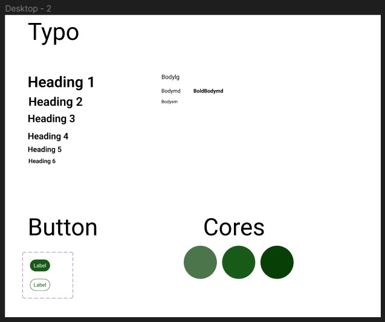
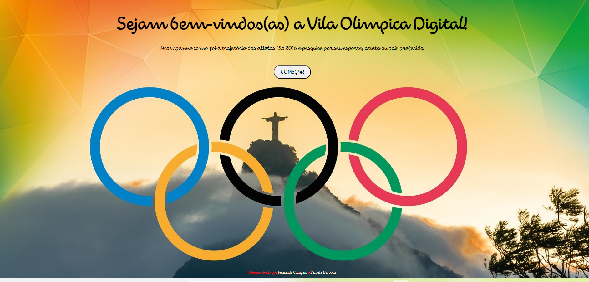
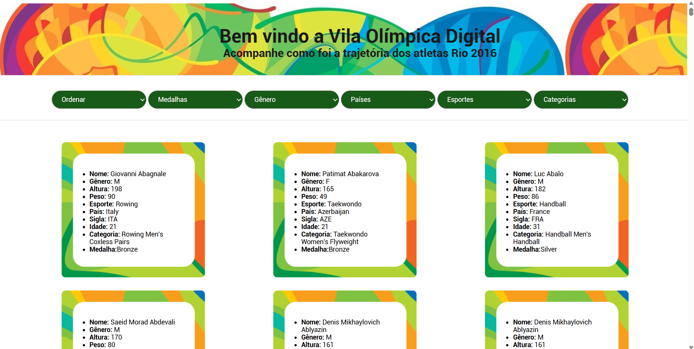
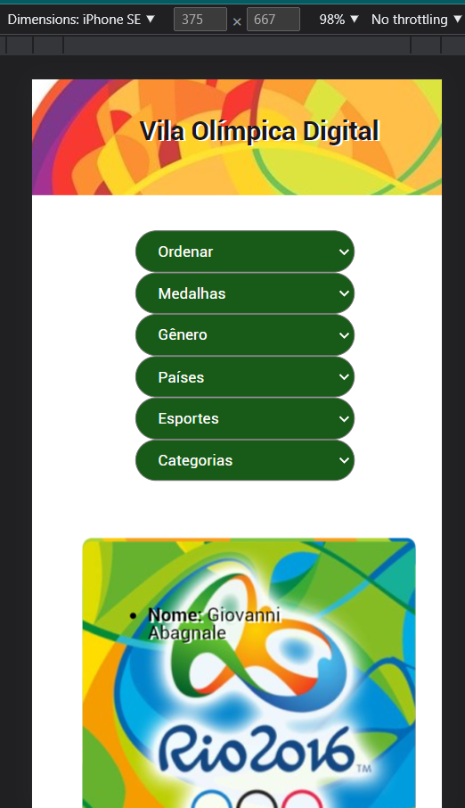

# Data Lovers

## Índice

* [1. Resumo](#1-resumo)
* [2. Desenvolvimento do projeto](#2-desenvolvimento-do-projeto)
* [3. Necessidades do usuário](#3-necessidades-do-usuário)
* [4. Projeto final](#4-projeto-final)
* [5. Ferramentas utilizadas](#5-ferramentas-utilizadas)
* [6. Desenvolvedoras](#6-desenvolvedoras)

***

## 1. Resumo

Este projeto consiste em uma página web interativa que reúne informações sobre os Jogos Olímpicos de 2016, sediados no Rio de Janeiro, Brasil. Através de um banco de dados abrangente, os usuários podem filtrar informações sobre atletas, esportes, países e categorias de preferência, revivendo a trajetória dos medalhistas olímpicos. A página web possui uma interface intuitiva, recursos de filtragem personalizada e oferece informações detalhadas sobre os medalhistas, proporcionando uma experiência envolvente e interativa.

 Confira nosso projeto clicando nesse link -> [Projeto Olimpíadas Rio 2016](https://fernanda-canicais.github.io/SAP010-data-lovers/)

## 2. Desenvolvimento do projeto

Neste projeto, utilizamos a ferramenta Trello para organizar e mapear as tarefas, adotando a metodologia de sprints. Para criar os protótipos de baixa e alta fidelidade, utilizamos a ferramenta Figma, explorando diferentes opções de navegação. Os protótipos foram testados com os usuários para identificar o fluxo de navegação mais eficiente. Com base nos resultados, selecionamos a abordagem que proporcionou a melhor experiência para os usuários.

Abaixo os dois protótipos: 
 
 

 
 

Após testes de usabilidade, foi determinado que a melhor opção de navegação para o site seria a utilização de cards, com paletas de cores e contrastes adequados para atender às diretrizes de acessibilidade. O protótipo de alta fidelidade foi criado com base nessa decisão, incorporando a abordagem de navegação por cards e aplicando os princípios de design visual.

Abaixo o protótipo de alta fidelidade:
 

Visual design:
 

## 3. Necessidades do usuário

Descrição da Funcionalidade da Página:
A página web foi projetada para permitir que os usuários pesquisem informações sobre medalhistas olímpicos de forma abrangente. Ao acessar a página, os usuários encontrarão filtros que permitem ordenar os medalhistas com base em critérios específicos. Esses filtros incluem ordenação alfabética, tipo de medalha (ouro, prata, bronze), gênero, país de origem, esporte e categoria. Após aplicar um filtro, a página exibirá os medalhistas correspondentes, fornecendo detalhes relevantes, como nome, nacionalidade, esporte, categoria e a porcentagem dos dados em questão.
A navegação na página é intuitiva e visualmente descritiva, proporcionando uma experiência facilitada para os usuários. Com a combinação de filtros e detalhes abrangentes, a página atende à necessidade dos usuários de obter informações relevantes e detalhadas sobre os medalhistas olímpicos, permitindo uma exploração completa e envolvente do mundo olímpico.

## 4. Projeto final

Após a integração de todas as ferramentas e atender aos critérios mínimos propostos, entregamos o projeto final. Abaixo, você pode visualizar a versão web e a versão mobile, que foram desenvolvidas com foco na responsividade.

Tela inicial: 

 
 
Tela de navegação:

 
 
Versão Mobile:

## 5. Ferramentas utilizadas

* HTML  
* JavaScript  
* CSS  
* Git  
* GitHub 
* Figma  
* Trello 

## 6 . Desenvolvedoras 

Este projeto foi desenvolvido por:

* Fernanda Caniçais: [GitHub](https://github.com/fernanda-canicais)
* Pamela Barbosa: [GitHub](https://github.com/PamelaBrsa)